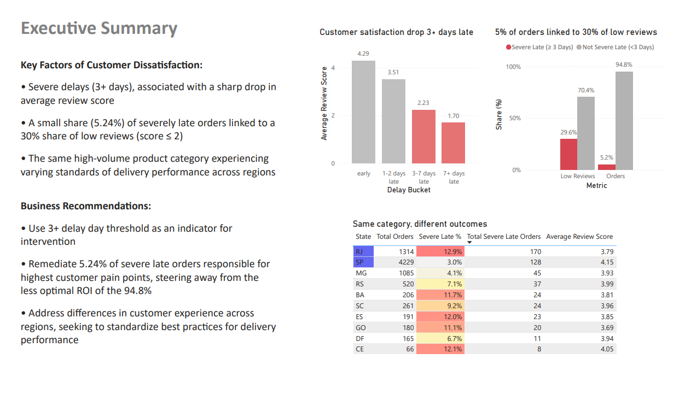
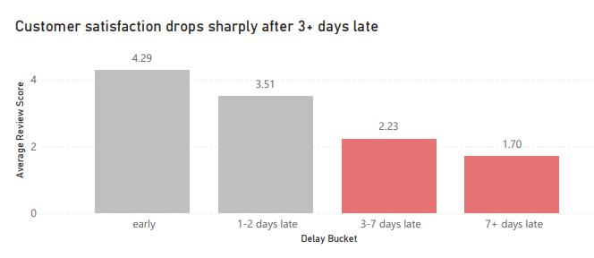
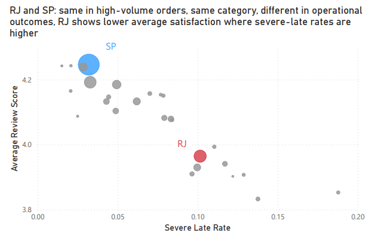
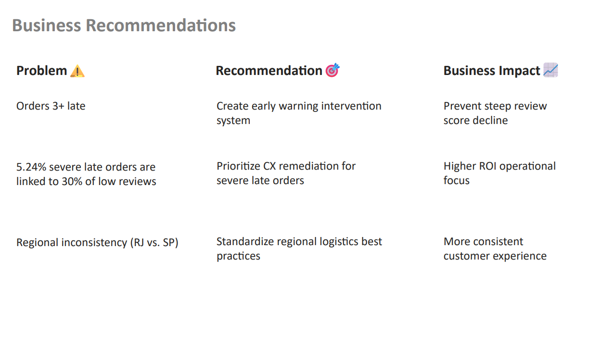

# Olist Delivery Performance Dashboard

## Overview

This Power BI dashboard analyzes delivery performance and customer satisfaction using Olist's Brazilian e-commerce dataset.

The analysis focuses on measuring delivery timeliness, identifying severe delivery delays, and evaluating their impact on customer review scores.

---

## Business Problem

How do delivery delays affect customer satisfaction, and where should Olist focus operational improvements to maximize customer experience?

---

## Key Insights

- 91.9% of orders arrived on time
- 5.24% of orders were severely late (3+ days)
- On-time orders averaged a review score of **4.29**
- Severely late orders averaged a review score of **1.94**
- A small percentage of delayed orders generated a disproportionate share of negative customer reviews

---

## Project Files

- [Executive Presentation (.pdf)](Olist_Presentation.pdf)
- [Power BI Dashboard (.pbix)](Olist_Presentation_Power%20BI.pbix)

---

## Dashboard Screenshots

### Executive Summary Dashboard

### Delay Impact Analysis

### Geographic Performance Analysis

### Business Recommendations

---

## Tools Used

- Power BI
- DAX
- PostgreSQL
- Python

---

**Author:** Jason Chew

Data Analytics Career Track | SQL | Python | Power BI
